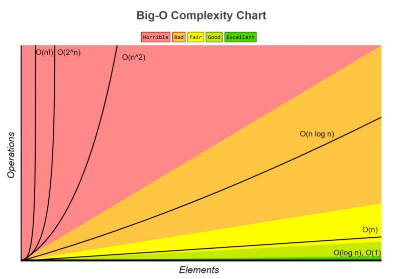

# Big O Asymptotic Analysis

In the realm of algorithm efficiency analysis, understanding Big O notation is crucial. It provides a standardized way to express how an algorithm's runtime changes as the size of its input increases.

## Key Concepts:

- Helps evaluate code performance as data volume grows.
- Indicates code quality and scalability.
- Measures scalability of code solutions.

## Big O Notation Categories:

1. **O(1)**: Constant Time
2. **O(n)**: Linear Time
3. **O(n log n)**: Log-Linear Time
4. **O(n^2)**: Quadratic Time

## Diagram:



1. Illustrates how algorithmic efficiency changes with input size.
2. Depicts the relationship between input growth and operation count.

# Rules of Big O

Understanding the principles behind calculating Big O notation is essential. Here are four fundamental rules:

## Rule 1: Worst Case

- Always consider the worst-case scenario.
- Focus on the scenario with the highest time complexity.

## Rule 2: Remove Constants

### Constants:

- Basic arithmetic operations.
- Variable assignments.
- Array element access.

### Why Remove Constants:

- Emphasizes scalability.
- Simplifies analysis.

## Rule 3: Different Terms for Inputs

- Utilize distinct variables for different input sizes.
- Enhances accuracy and comparison.

## Rule 4: Drop Non-Dominants

- Exclude terms with lower growth rates.
- Focus on the dominating factor.

# Examples of Big O Notations

## O(n) - Linear Time

- Basic operations increase linearly with input size.
- Common and fair complexity.

## O(1) - Constant Time

- Operations remain constant regardless of input size.
- Indicates high efficiency.

## O(n^2) - Quadratic Time

- Operations grow quadratically with input size.
- Common in nested loops and certain sorting algorithms.

# Code Samples

### Linear Time Complexity (O(n))

```python
def linear_search(arr, target):
    for item in arr:
        if item == target:
            return True
    return False
```

# Constant Time Complexity (O(1))

```
def get_first_element(arr):
    return arr[0]
```

# Quadratic Time Complexity (O(n^2))

```
def bubble_sort(arr):
    n = len(arr)
    for i in range(n):
        for j in range(0, n-i-1):
            if arr[j] > arr[j+1]:
                arr[j], arr[j+1] = arr[j+1], arr[j]
    return arr
```
